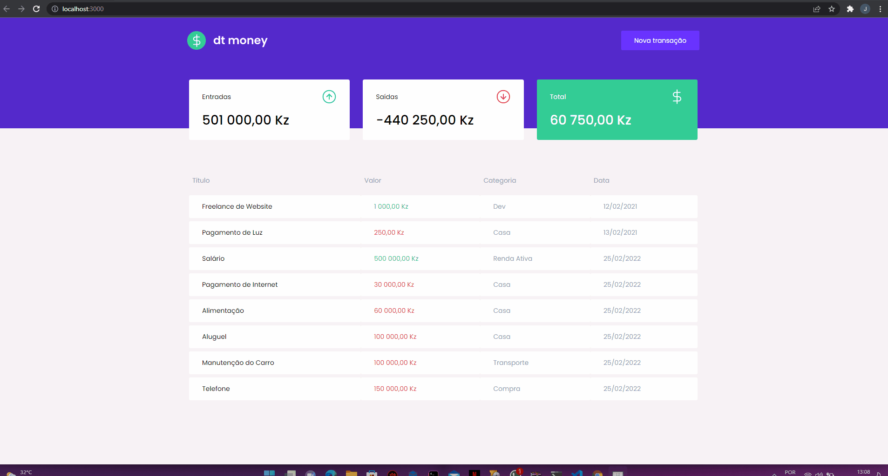

# dtmoney

  
  
  

  dtmoney is a personal finance control application whose objective is to control a person's financial strength by registering all the inflows and outflows of money in their account and thus keeping the user informed of their expenses and expenses through a dashboard. Using modern development concepts like hooks, styled-components, front-end without back-end with mirageJS and typescript.
  

  

> This project was made for learning purposes only and comes from Rocketseat's Ignite is a professional acceleration program with certified and market-recognized training.

# Development setup

> yarn or npm is required

After cloning this repo:

### How to run

- Run `yarn` or `npm` in the root folder to install all dependencies
- Run `yarn start` to up the project
- In browser go to url `http://localhost:3000`

# License

[MIT License](/LICENSE)
